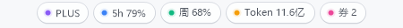
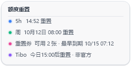
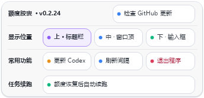
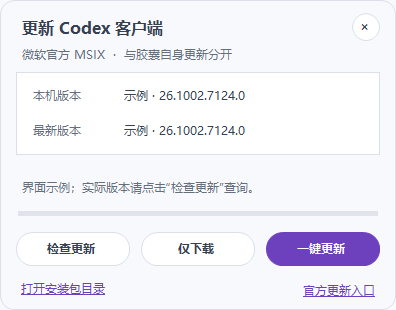

# Codex Quota Pills

Windows 版 Codex 的额度小胶囊，显示套餐、5 小时和周额度、累计 Token、可用重置券。胶囊跟随 Codex 窗口，切到其他程序或最小化时自动隐藏。

**当前正式版本：[v0.2.24](https://github.com/jinfu0111-gif/CodexQuotaPills/releases/tag/v0.2.24)。** 以下配图由该版本的实际界面绘制生成，使用示例数据。后续迭代默认留在本机，仅在维护者主动要求时发布。



> 非官方社区项目，与 OpenAI 无隶属或背书关系。程序不修改 Codex 安装文件或账户额度。自动续跑默认开启，额度恢复后会向符合条件的原对话发送续跑消息；可在 PLUS 菜单暂停。

## 开始使用

1. 解压便携包，运行 `CodexQuotaPills.exe`。
2. 正常启动并登录 Windows 版 Codex。窗口在前台时，胶囊会出现；额度按设置的间隔自动刷新。
3. 点击套餐胶囊打开菜单。图中为 `PLUS`，其他套餐显示对应名称。
4. 要登录 Windows 后自动跟随 Codex，可把程序快捷方式放入 Windows 启动文件夹。安装版也可勾选“跟随 Codex 启动与退出”。

监听进程在后台等待 Codex；Codex 启动后才启动额度界面，退出两秒后关闭界面。Codex 更新重启或额度界面异常退出时，监听会恢复界面，启动失败按 5 秒间隔重试。菜单中的“退出程序”会同时停止监听。

## 胶囊怎么看

| 胶囊 | 显示内容 | 操作 |
| --- | --- | --- |
| 紫色套餐，如 `PLUS` | 当前账户套餐 | 点击打开统一菜单 |
| 蓝色 `5h` | 5 小时额度的剩余百分比 | 重置时间在周额度悬停卡中查看 |
| 绿色 `周` | 周额度的剩余百分比 | 悬停查看额度重置汇总和 Tibo 信息 |
| 橙色 `Token` | 当前账户累计 Token | 自动刷新 |
| 粉色 `券` | 当前可用重置券数量，包括已确认的 `券 0` | 悬停逐张查看到期时间 |

额度剩余不超过 20% 时，对应圆点变橙色；用尽时变红色。尚未读到的数据不会编造数值。空间变窄时先收起 Token，再收起券，优先保留套餐和两档额度；券的数量和最早到期时间仍可从周额度汇总查看。

### 周额度：重置汇总

悬停绿色周额度胶囊，查看 5h 重置、周重置、重置券数量及最早到期时间，以及 Tibo 预告或当日完成信息。移开鼠标即收起。



### 粉色重置券：每张券的到期时间

悬停粉色“券”胶囊，一张券一行，按到期时间从早到晚显示，包含年份和时间，使用本机时区。同一时间到期的多张券仍分别列出；已使用或已过期状态的券不列为可用券。


接口缺少某张券的到期时间时，该行显示“到期时间待刷新”；只返回数量时提示缺少的记录数。缓存信息有明确标记，实时刷新后更新。此胶囊用于查看信息，不会使用重置券。

## PLUS 菜单

点击一次套餐胶囊即可打开。顶部显示当前胶囊版本和“检查 GitHub 更新”，下方集中提供显示位置、更新 Codex、刷新间隔、退出程序和自动续跑管理。



- **显示位置**：上为系统标题栏，中为对话窗口顶部，下为输入框附近。选择后自动保存，并跟随窗口拖动、缩放和显示器 DPI 变化。
- **刷新间隔**：调整额度刷新频率；其中“使用指引”可回看程序内说明。完成过的指引不会因本次文案更新再次自动弹出。
- **检查 GitHub 更新**：查询本仓库的最新正式版。当前本机版可能领先 GitHub，已有本机版不会因此降级。
- **更新 Codex**：打开 Codex 客户端更新面板。
- **额度恢复后自动续跑**：查看检测结果，暂停或恢复续跑、取消所选候选任务。
- **退出程序**：同时停止额度界面和后台监听。

### 两种更新

胶囊自身更新：PLUS → 检查 GitHub 更新 → 下载并校验 → 启用新版本。检查使用公开 GitHub API，无需登录，后台最多每 24 小时检查一次；下载和启用需要点击。

只接受本仓库稳定 Release 的指定便携 ZIP、GitHub SHA-256 摘要及一致的程序版本。新版本放在 `%LOCALAPPDATA%\CodexQuotaPills\GitHubUpdates` 的独立目录，迁移显示设置，备份并切换原来指向旧胶囊的 Startup 入口；没有入口时不额外创建。旧程序和共享续跑记录保留，切换失败会尝试恢复。结果见更新目录的 `result.json`。

Codex 客户端更新：PLUS → 更新 Codex → 检查更新，可选择仅下载安装包或执行 MSIX 更新。面板中的安装动作需要主动点击，不会静默关闭正在运行的 Codex。便携版优先缓存至程序目录的 `packages`，不可写时使用本机用户目录；重复使用前重新校验摘要与包身份。



## Tibo 重置信息

日常信息在周额度悬停卡查看。只有出现新的有效公告时，才显示一次浅色胶囊横幅；**10 秒后自动关闭，也可点击右侧圆形 × 关闭**。两行文字左对齐，关闭按钮居中于横幅高度。启动已有公告、持续轮询、重启和手动关闭不会重复提醒。


Tibo 属于非官方信息，不代表账户实际恢复，也不触发自动续跑。只接受固定 HTTPS 数据源 `https://didcodexreset.com/api/status.json` 中带 `x.com/thsottiaux/status/...` 原帖的有效事件；不发送账户或对话数据，不自动跟随重定向，不以运营者手工记录替代原帖。缓存、离线或过期数据不会显示为有效预告。

需要修改横幅细节时，查看 [重置信息效果图](docs/reset-radar-banner-preview.md)，包含完成、预告、关闭按钮悬停和 2 倍清晰版。

## 额度恢复后自动续跑

默认在后台检测，不必先打开面板或点击扫描。额度恢复后，只在符合条件的原对话继续。PLUS → 额度恢复后自动续跑用于查看和管理；关闭面板不会暂停，主动暂停后下次启动仍保持暂停。


- 启动约 1 秒后检查，此后每 30 秒检测最近最多 500 个未归档根对话。只识别最新执行的结构化 `usageLimitExceeded` 失败，不根据聊天文字猜测。
- 实时核验 5h 和周额度；尚未恢复时继续等待，提前恢复也可继续。预计时间只是参考，不会使用券、切换账户或绕过限制。
- 发送前重新检查原执行、未归档状态、原对话状态、owner 能力和设置指纹。原对话需由 Codex 桌面加载；继承原模型及权限，不代答审批。
- 手动停止、完成、执行中、等待审批、子任务和远程任务不会续跑。每个失败轮次最多尝试一次，每个对话累计最多 3 次；发送意图先落盘，结果不确定时不会重发。
- 开关和防重复记录位于 `%LOCALAPPDATA%\CodexQuotaPills\AutoResume\ledger.json`。保留已取消轮次、累计计数和主动暂停状态；记录损坏或账户变化等安全停止不会自行清空。
- 已对 Codex 26.930.7945.0 和 26.1002.7124.0 做只读握手验证。连接时核验官方 WindowsApps 服务路径、状态协议 11、续跑协议 2、方法及设置继承合约；后续版本合约兼容时自动支持，不靠固定版本白名单。不兼容时停止并提示维护，详见 [兼容性维护](docs/desktop-ipc-compatibility.md)。

已验证策略、隔离模拟发送和真实客户端只读扫描；**尚未完成真实额度耗尽到自然重置的端到端验证**。桌面快照缺少完整既有排队消息列表，无法保证与用户操作完全原子互斥；有排队消息或重要任务时可先暂停。

## 数据与安全

额度通过本机 `codex app-server` 读取：`account/read`、`account/rateLimits/read`、`account/usage/read`。只保存显示所需缓存，重置券只保留可用记录的到期时间，不保存券 ID、认证令牌、Cookie、请求头或浏览器存储。

自动续跑在本机读取结构化状态并发送固定续跑消息，不上传对话正文；账本只记录任务标识、状态指纹、计数和不可逆账户身份摘要。日常额度显示不需管理员权限；主动安装 Codex 更新时可能需要 Windows 系统授权。

监测进程通过当前用户、最低权限、无密码且无触发器的临时 Task Scheduler 任务独立启动，就绪后删除任务定义。系统禁止时记录 `lifecycle.log` 并回退普通启动，回退进程可能受启动方生命周期影响。

更多边界见 [SECURITY.md](SECURITY.md)。杀毒误报请先核对 SHA-256，再按 [误报处理说明](FALSE_POSITIVE_GUIDE.md) 提交复核。

## 开发与验证

需要 Windows 10/11、系统 .NET Framework 4.x 和可运行 `codex app-server` 的 Codex CLI。

```powershell
.\test.ps1
.\build.ps1
.\tools\export-ui-previews.ps1
.\tools\package-release.ps1 -Version 0.2.24
```

构建输出 `bin\CodexQuotaPills.exe`。预览脚本从此程序生成当前说明配图，使用示例数据，不读取真实账户或发送续跑消息。安装包可用 Inno Setup 编译 `installer.iss`。

打包脚本拒绝覆盖已有版本，只复制公开源码和允许列表中的当前产品资源，生成便携 ZIP、对应源码 ZIP 及 SHA-256。运行设置与续跑记录不装入 ZIP；迁移本机设置应在打包后进行。

诊断可运行 `bin\CodexQuotaPills.exe --snapshot`，结果写入同目录 `snapshot.txt`；分享前检查其中额度和 Token 数字。单独启动界面可使用 `--standalone`。

## 开源与发布

本项目基于 `ivan51769/CodexUsageOverlay v1.3.6` 的 AGPL-3.0 代码继续开发，保留本机 app-server、安全校验、缓存、DPI 和 Windows layered-window 实现，新增胶囊布局、定位、生命周期、自动续跑与更新管理。

`jlcodes99/cockpit-tools` 提供了 composer 附近胶囊的产品方向参考；调研时根目录无明确许可证，未复制其源码。布局与绘制由本项目实现。

采用 [GNU AGPL v3.0](LICENSE)，保留 [来源声明](NOTICE.md)、[第三方声明](THIRD_PARTY_NOTICES.md) 和完整复用代码许可证。参与贡献见 [CONTRIBUTING.md](CONTRIBUTING.md)。

**新版本默认只在本机迭代、验证和启用。只有维护者主动明确要求发布时，才推送源码或标签、创建 GitHub Release 和上传附件。** 正式发布应上传指定名称的便携 ZIP、源码 ZIP 及 SHA-256 文件，并确认 GitHub 资产提供 `sha256:` digest；草稿和预发布不作为稳定更新。